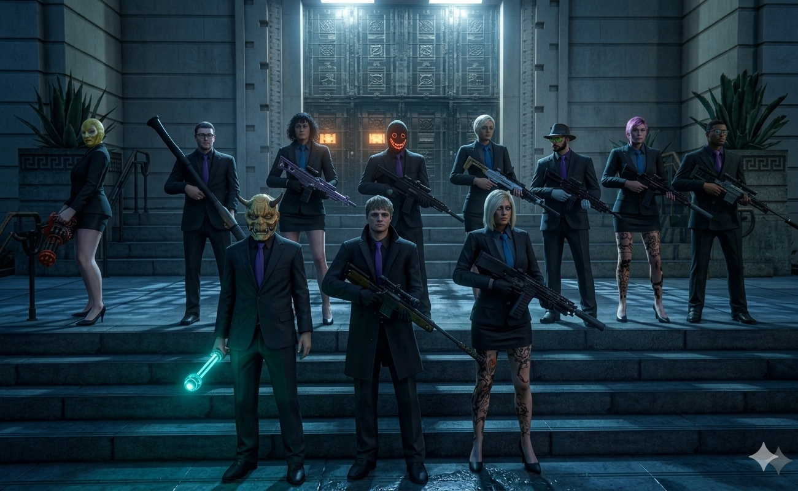

# advertise-gta-crew-repo

## *夜桜會 Crew Recruitment* 


Welcome to the official recruitment repository for the **Yozakura-kai Crew**.



This repository hosts a recruitment website designed to introduce the crew and provide information for prospective members.

## About

The website is built with **HTML** and is securely published using **GitHub Pages** over **HTTPS**. It is intended to serve as a simple, reliable, and publicly accessible recruitment page.

## Features

* Static website built with HTML
* Secure hosting via GitHub Pages (HTTPS)
* Fast and lightweight
* Easy to maintain and update

## Website

Once GitHub Pages is enabled, the recruitment page will be available at:

```text
https://<your-github-username>.github.io/<repository-name>/
```

Replace `<your-github-username>` and `<repository-name>` with your actual GitHub account and repository name.

## Contributing

Suggestions and improvements are welcome. Feel free to open an issue or submit a pull request.

## License

Please add your preferred license (such as the MIT License) if you intend to make this repository open source.


Copyright Notice

The Yozakura-kai emblem is protected by copyright. Unauthorized use, reproduction, distribution, or modification of the emblem is strictly prohibited.